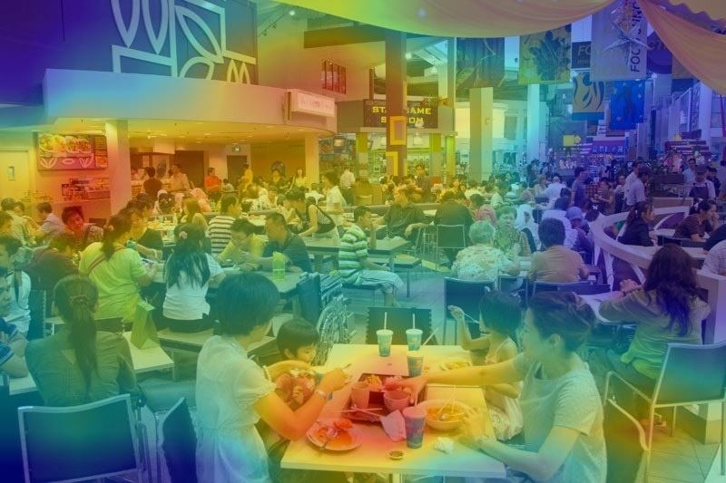

# Release of Places365-CNNs
We release various convolutional neural networks (CNNs) trained on Places365 to the public. Places365 is the latest subset of [Places2 Database](http://places2.csail.mit.edu). There are two versions of Places365: **Places365-Standard** and **Places365-Challenge**. The train set of Places365-Standard has ~1.8 million images from 365 scene categories, where there are at most 5000 images per category. We have trained various baseline CNNs on the Places365-Standard and released them as below. Meanwhile, the train set of Places365-Challenge has extra 6.2 million images along with all the images of Places365-Standard (so totally ~8 million images), where there are at most 40,000 images per category. Places365-Challenge will be used for the Places2 Challenge 2016 to be held in conjunction with the [ILSVRC](http://www.image-net.org/challenges/LSVRC/) and [COCO](http://mscoco.org/dataset/#overview) joint workshop at [ECCV 2016](http://www.eccv2016.org/). 

The data Places365-Standard and Places365-Challenge are released at [Places2 website](http://places2.csail.mit.edu).

### Pre-trained CNN models on Places365-Standard:

* AlexNet-places365: [deploy](deploy_alexnet_places365.prototxt) [weights](http://places2.csail.mit.edu/models_places365/alexnet_places365.caffemodel)
* GoogLeNet-places365: [deploy](deploy_googlenet_places365.prototxt) [weights](http://places2.csail.mit.edu/models_places365/googlenet_places365.caffemodel)
* VGG16-places365: [deploy](deploy_vgg16_places365.prototxt) [weights](http://places2.csail.mit.edu/models_places365/vgg16_places365.caffemodel)
* VGG16-hybrid1365: [deploy](deploy_vgg16_hybrid1365.prototxt) [weights](http://places2.csail.mit.edu/models_places365/vgg16_hybrid1365.caffemodel)
* ResNet152-places365 fine-tuned from [ResNet152-ImageNet](https://github.com/KaimingHe/deep-residual-networks/blob/master/prototxt/ResNet-152-deploy.prototxt): [deploy](deploy_resnet152_places365.prototxt) [weights](http://places2.csail.mit.edu/models_places365/resnet152_places365.caffemodel) 
* ResNet152-hybrid1365: [deploy](deploy_resnet152_hybrid1365.prototxt) [weights](http://places2.csail.mit.edu/models_places365/resnet152_hybrid1365.caffemodel)
* ResNet152-places365 trained from scratch using Torch: [torch model](http://places2.csail.mit.edu/models_places365/resnet152_places365.t7) converted caffemodel:[deploy](http://netdissect.csail.mit.edu/dissect/zoo/resnet-152-torch-places365.prototxt) [weights](http://netdissect.csail.mit.edu/dissect/zoo/resnet-152-torch-places365.caffemodel). It is the original ResNet with 152 layers. On the validation set, the top1 error is 45.26% and the top5 error is 15.02%.
* ResNet50-places365 trained from scratch using Torch: [torch model](http://places2.csail.mit.edu/models_places365/resnet50_places365.t7). It is Preact ResNet with 50 layers. The top1 error is 44.82% and the top5 error is 14.71%.
* To use the alexnet and vgg16 caffemodels in Torch, use the torch library [loadcaffe](https://github.com/szagoruyko/loadcaffe), where you could simply load the caffe model use the following commands. But note that the input image scale should be from 0-255, which is different to the 0-1 scale in the previous resnet Torch models trained from scratch in [fb.resnet.torch](https://github.com/facebook/fb.resnet.torch).
```
	require 'loadcaffe'
	model = loadcaffe.load('deploy_alexnet_places365.prototxt', 'alexnet_places365.caffemodel', 'cudnn')
```
* PyTorch Places365 models: [AlexNet](http://places2.csail.mit.edu/models_places365/alexnet_places365.pth.tar), [ResNet18](http://places2.csail.mit.edu/models_places365/resnet18_places365.pth.tar), [ResNet50](http://places2.csail.mit.edu/models_places365/resnet50_places365.pth.tar), [DenseNet161](http://places2.csail.mit.edu/models_places365/densenet161_places365.pth.tar). The models are trained in Python2.7+PyTorch 0.2, see [this issue](https://github.com/CSAILVision/places365/issues/25) if you run into some format errors. **You don't need to untar the pytorch model files, refer to the following placesCNN demo code to see how to load the model**. Run [basic code](run_placesCNN_basic.py) to get the scene prediction from PlacesCNN:
```
    python run_placesCNN_basic.py

    RESULT ON http://places.csail.mit.edu/demo/12.jpg
    0.519 -> patio
    0.394 -> restaurant_patio
    0.018 -> beer_garden
    0.017 -> diner/outdoor
    0.016 -> courtyard
```
or run [unified code](run_placesCNN_unified.py) to predict scene categories, indoor/outdoor type, [scene attributes](https://cs.brown.edu/~gen/sunattributes.html), and the [class activation map](http://cnnlocalization.csail.mit.edu/) together from PlacesCNN:
```
    python run_placesCNN_unified.py

    RESULT ON http://places.csail.mit.edu/demo/6.jpg
    --TYPE: indoor
    --SCENE CATEGORIES:
    0.690 -> food_court
    0.163 -> cafeteria
    0.033 -> dining_hall
    0.022 -> fastfood_restaurant
    0.016 -> restaurant
    --SCENE ATTRIBUTES:
    no horizon, enclosed area, man-made, socializing, indoor lighting, cloth, congregating, eating, working
    Class activation map is output as cam.jpg
```


* Train PlacesCNN using Pytorch. The training script is at [here](train_placesCNN.py). Download the Places365 standard easyformat split at [here](http://data.csail.mit.edu/places/places365/places365standard_easyformat.tar). Untar it to some folder. Then run the following:
```
    python train_placesCNN.py -a resnet18 /xxx/yyy/places365standard_easyformat
```

The category index file is [the file](categories_places365.txt). Here we combine the training set of ImageNet 1.2 million data with Places365-Standard to train VGG16-hybrid1365 model, its category index file is [the file](categories_hybrid1365.txt). The indoor and outdoor labels for the categories is in [the file](IO_places365.txt). The scene hierarchy is listed at [here](https://docs.google.com/spreadsheets/d/1H7ADoEIGgbF_eXh9kcJjCs5j_r3VJwke4nebhkdzksg/edit?usp=sharing), with a simple browswer at [here](http://places2.csail.mit.edu/scene_hierarchy.html).

### Performance of the Places365-CNNs
The performance of the baseline CNNs is listed below. ResidualNet's performance will be updated soon. We use the class score averaged over 10-crops of each testing image to classify. Here we also fine-tune the resNet152 on Places365-standard, for 10 crop average it has 85.08% on the validation set and 85.07% on the test set for top-5 accuracy.


As comparison, we list the performance of the baseline CNNs trained on [Places205](http://places.csail.mit.edu/downloadCNN.html) as below. There are 160 more scene categories in Places365 than the Places205, the top-5 accuracy doesn't drop much.


The performance of the deep features of Places365-CNNs as generic visual features is listed below ResidualNets' performances will be included soon. The setup for each experiment is the same as the ones in our [NIPS'14 paper](http://places.csail.mit.edu/places_NIPS14.pdf)


Some qualitative prediction results using the VGG16-Places365:


### Reference
Link: [Places2 Database](http://places2.csail.mit.edu), [Places1 Database](http://places.csail.mit.edu)

Please cite the following [IEEE Transaction on Pattern Analysis and Machine Intelligence paper](http://places2.csail.mit.edu/PAMI_places.pdf) if you use the data or pre-trained CNN models.

```
 @article{zhou2017places,
   title={Places: A 10 million Image Database for Scene Recognition},
   author={Zhou, Bolei and Lapedriza, Agata and Khosla, Aditya and Oliva, Aude and Torralba, Antonio},
   journal={IEEE Transactions on Pattern Analysis and Machine Intelligence},
   year={2017},
   publisher={IEEE}
 }

```

### Acknowledgements and License

Places dataset development has been partly supported by the National Science Foundation CISE directorate (#1016862), the McGovern Institute Neurotechnology Program (MINT), ONR MURI N000141010933, MIT Big Data Initiative at CSAIL, and Google, Xerox, Amazon and NVIDIA. Any opinions, findings, and conclusions or recommendations expressed in this material are those of the author(s) and do not necessarily reflect the views of the National Science Foundation and other funding agencies. 

The pretrained places-CNN models can be used under the Creative Common License (Attribution CC BY). Please give appropriate credit, such as providing a link to our paper or to the [Places Project Page](http://places2.csail.mit.edu). The copyright of all the images belongs to the image owners.
